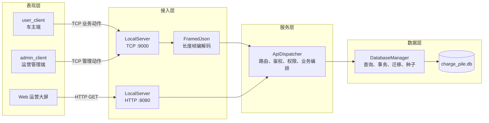
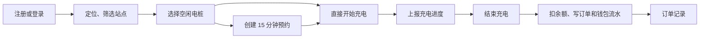
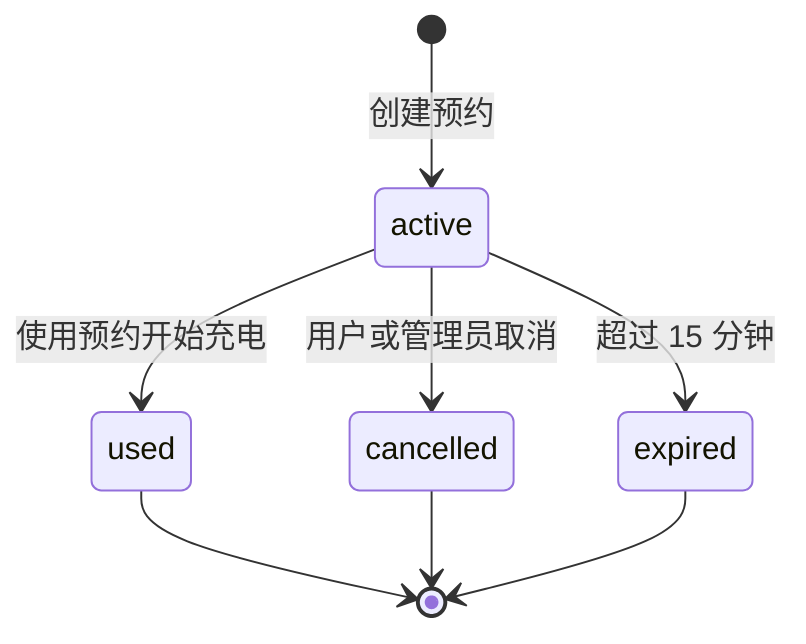
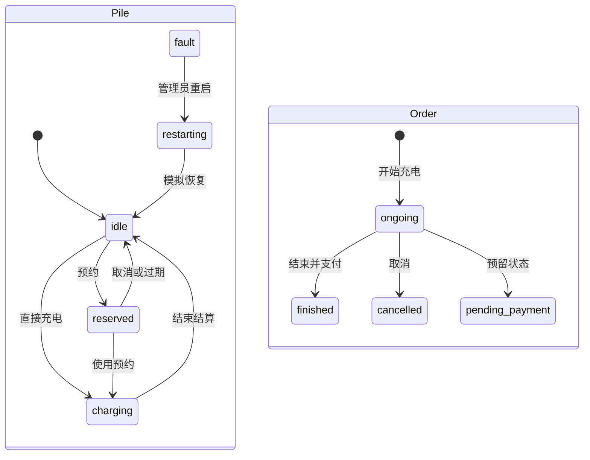
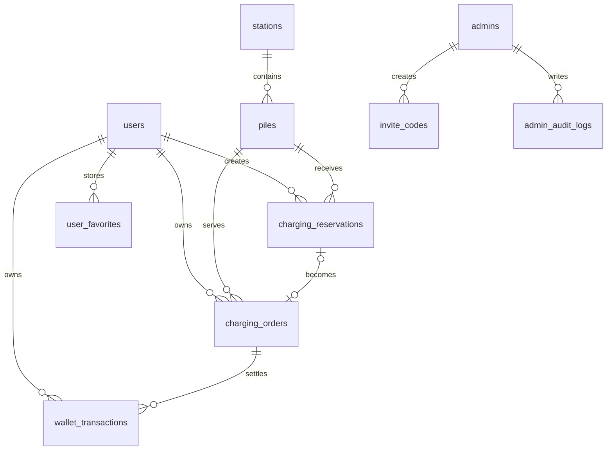
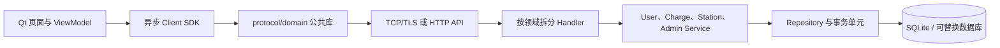

# 充电桩综合管理系统

基于 Qt 6、C++17、SQLite 和 ECharts 的充电业务教学与演示系统。项目包含车主端、运营管理端、统一后端和 Web 运营大屏，覆盖“找站—预约—充电—结算—运维管理”的主要流程。

当前系统适合课程设计、桌面演示和单机/小型局域网实验，不应直接作为生产充电平台部署。真实设备接入、可信计量、TLS、安全密钥管理、高可用和完整运维体系仍需建设。

## 目录

- [系统组成](#系统组成)
- [总体架构](#总体架构)
- [核心设计原理](#核心设计原理)
- [功能模块](#功能模块)
- [关键业务流程](#关键业务流程)
- [数据架构](#数据架构)
- [通信接口](#通信接口)
- [目录与代码职责](#目录与代码职责)
- [构建与运行](#构建与运行)
- [测试](#测试)
- [当前问题](#当前问题)
- [下一步优化方向](#下一步优化方向)
- [相关文档](#相关文档)

## 系统组成

| 子系统 | 技术 | 主要职责 |
|---|---|---|
| `user_client` | Qt 6 Widgets、Network、D-Bus | 用户注册登录、定位找站、收藏、预约、充电、充值、订单和个人资料 |
| `admin_client` | Qt 6 Widgets、Charts、Network | 销售业绩、桩状态、桩站管理、用户管理、预约管理和权限管理 |
| `admin_server` | Qt 6 Core、Network、SQL | TCP/HTTP 接入、身份验证、权限校验、业务编排和数据库访问 |
| `common` | C++ 静态库 | 数据模型、JSON 转换、帧协议、主题样式、密码处理和数据库实现 |
| Web 运营大屏 | HTML、CSS、JavaScript、ECharts | 营收趋势、设备状态、近期订单和站点分页展示 |
| SQLite | Qt QSQLITE | 用户、设备、预约、订单、账务、权限、审计和扩展数据 |

所有业务数据统一由 `admin_server` 管理。两个 Qt 客户端只发送业务动作，不共享数据库文件，也不发送原始 SQL。

## 总体架构



### 进程与线程模型

系统运行时包含三个本地可执行程序和一个浏览器页面：

- `admin_server` 是无窗口后端进程。
- `user_client` 和 `admin_client` 是相互独立的 Qt GUI 进程。
- Web 大屏由 `admin_server` 提供静态文件和只读 JSON 接口。

后端内部采用两个线程：

1. 主线程创建 `DatabaseManager`、SQLite 连接和 `ApiDispatcher`。
2. 网络线程运行 `LocalServer`、两个 `QTcpServer` 及其套接字。
3. 网络线程收到请求后，通过 Qt 队列信号交给主线程。
4. 主线程串行执行业务和 SQL，再把响应排队送回网络线程。

这种结构遵守“Qt SQL 连接只能在创建线程使用”的约束，也避免了同一 SQLite 连接跨线程访问；代价是业务请求无法并行，高负载时会在主线程队列中等待。

## 核心设计原理

### 1. 客户端不直连数据库

SQLite 是嵌入式数据库，没有远程数据库服务能力。客户端只依赖 `ServerApiClient` 或 `AdminApiClient`，所有状态判断、权限检查、余额变更和事务均在后端完成。

### 2. TCP 使用长度帧解决粘包与拆包

TCP 只提供连续字节流，不保留消息边界。每条业务消息采用：

```text
┌──────────────────────┬──────────────────────────────┐
│ 4 字节大端无符号长度 │ N 字节 UTF-8 紧凑 JSON      │
└──────────────────────┴──────────────────────────────┘
```

前 4 字节只表示后续 JSON 的字节数，不属于 JSON 内容。`FramedJson::encode()` 负责编码，`FramedJson::take()` 负责从接收缓冲中取出完整帧。单个 JSON 负载上限为 4 MiB。

### 3. 请求与响应通过 requestId 对应

客户端为每次调用生成 UUID，放入 `requestId`。服务端在响应中原样返回该值，客户端据此匹配响应。统一请求结构为：

```json
{
  "version": 1,
  "requestId": "uuid",
  "action": "admin.dashboard",
  "token": "登录后携带",
  "data": {}
}
```

统一响应包含 `version`、`requestId`、`ok`、`code`、`message` 和 `data`。

### 4. 身份、会话与权限

- 用户以手机号和密码登录；未注册账号必须先注册。
- 管理员以用户名和密码登录，也可通过未使用的邀请码注册。
- 用户和管理员 token 当前保存在后端内存中，有效期 12 小时。
- 管理权限采用 `admin`、`operator`、`auditor` 三种角色和细粒度权限键。
- 管理端页面是否可操作最终以后端权限校验为准。
- 用户被冻结后不能继续登录或预约；已有 token 在后续鉴权时也会失效。

### 5. 事务与数据库约束共同保证一致性

预约、开始充电、停止充电、充值、强制删除和邀请码消费等写操作由服务端处理。SQLite 使用外键、检查约束、唯一索引和事务共同保护数据：

- 一个用户最多存在一条有效预约。
- 一个电桩最多被一个用户有效预约。
- 一个用户最多存在一笔进行中或待支付订单。
- 一个电桩最多存在一笔进行中订单。
- 订单保存充电单价快照，后续调价不改变历史订单。
- 结算时订单、余额、钱包流水和电桩状态应在同一事务完成。

### 6. 本地 UI 状态与服务端业务状态分离

主题、筛选条件、图表画笔和分页显示属于客户端状态；用户、预约、订单、余额、桩状态和权限属于服务端状态。深色模式通过 `QSettings` 保存，业务数据仍以服务端为准。

## 功能模块

### 用户端 user_client

| 模块 | 功能 | 核心实现 |
|---|---|---|
| 启动与会话 | 服务探测、登录循环、登出后返回登录窗 | `main.cpp` |
| 账号管理 | 手机号密码登录、注册、退出 | `LoginDialog`、`ServerApiClient` |
| 定位与找站 | GeoClue、IP 定位回退、城区和关键字筛选、距离排序 | `LocationProvider`、`MainWindow` |
| 站点与电桩 | 站点分页、功率/接口筛选、状态展示、地图导航 | `MainWindow` |
| 收藏 | 收藏站点或电桩、仅看收藏、服务端持久化 | `MainWindow`、`favorites.*` |
| 预约 | 对空闲桩创建 15 分钟预约、倒计时、取消和恢复 | `MainWindow`、`reservation.*` |
| 充电 | 开始、进度展示、结束与结算、进行中订单恢复 | `MainWindow`、`charge.*` |
| 个人中心 | 资料、头像路径、余额、充值和订单记录 | `MainWindow`、`user.*`、`wallet.*` |
| 主题 | 浅色/深色 QSS，本机记忆 | `StyleHelper`、`QSettings` |

用户端采用“充电站 / 充电 / 我的”底部导航；充电页再分为“预约 / 我的预约 / 充电”三个子页。

### 管理端 admin_client

| 页面 | 功能 | 主要出站动作 |
|---|---|---|
| 销售业绩 | 今日、本月、累计营收；7/30 日折线；近期订单 | `admin.dashboard` |
| 电桩状态 | 状态统计、饼图、关键字明细 | `admin.dashboard`、`admin.piles.list` |
| 充电桩管理 | 城区/站点/状态筛选，增删改，故障桩重启 | `admin.piles.*` |
| 充电站管理 | 搜索、增删改、站内电桩明细 | `admin.stations.*` |
| 用户管理 | 用户查询、冻结/解冻、查看和删除订单 | `admin.users.*`、`admin.orders.delete` |
| 预约管理 | 全站有效预约、管理员解除预约 | `admin.reservations.*` |
| 权限管理 | 邀请码发放、角色权限读取与修改 | `admin.invites.*`、`admin.permissions.*` |

删除占用中的电桩或电站采用两阶段确认：先以 `force=false` 探测，服务端返回 `NEED_FORCE` 后由用户二次确认，再以 `force=true` 执行。

故障桩重启属于模拟运维：仅 `fault` 状态可重启，先进入 `restarting`，定时后恢复为 `idle`。

### 后端 admin_server

| 模块 | 职责 |
|---|---|
| `LocalServer` | TCP/HTTP 监听、连接管理、收发缓冲、静态文件服务 |
| `FramedJson` | TCP 报文编码、拆包、粘包处理和大小校验 |
| `ApiDispatcher` | action 路由、token 鉴权、RBAC、参数编排和统一响应 |
| `DatabaseManager` | SQLite 初始化、查询、写操作、事务、审计和 CSV 导入 |
| `JsonCodec` | C++ 模型和 JSON 对象转换 |
| `PasswordCrypto` | 带随机盐的 SHA-256 密码摘要及旧数据迁移 |

后端 action 按领域分为：

- 公共：健康检查、用户/管理员登录注册、Web 看板。
- 用户：站点、电桩、资料、收藏、钱包、预约、充电和订单。
- 管理：看板、桩站 CRUD、用户、订单、预约、邀请码和权限。

### Web 运营大屏

Web 页面通过 HTTP :8080 访问 `/api/health`、`/api/dashboard` 和 `/api/stations`，展示：

- 7 日或 30 日营收趋势。
- 营收、订单、用户、站点等 KPI。
- 电桩状态与在线率。
- 近期订单。
- 站点搜索和分页。
- 每 10 秒自动刷新。

Web 大屏不包含管理写操作。

## 关键业务流程

### 用户业务主线



### 预约状态



当前业务规则是每个用户最多一条 `active` 预约。项目旧文档中出现过“最多三条”的描述，该规则已废弃。

### 电桩与订单状态



当前用户端没有独立的待支付页面，正常停止充电会直接扣除余额并将订单置为 `finished/paid`。

## 数据架构

数据库默认位于系统通用数据目录：

```text
<GenericDataLocation>/ChargePileLab/charge_pile.db
```

Linux 通常对应 `~/.local/share/ChargePileLab/charge_pile.db`。也可通过 `CHARGE_PILE_DB_PATH` 指定。

### 核心关系



### 表分组

| 分组 | 数据表 | 当前用途 |
|---|---|---|
| 账号 | `users`、`admins` | 用户和管理员身份、角色、余额、状态 |
| 资产 | `stations`、`piles` | 电站、电桩规格和当前状态 |
| 核心业务 | `charging_reservations`、`charging_orders` | 预约与充电订单生命周期 |
| 账务 | `wallet_transactions`、`recharge_records` | 充值、扣费和余额审计 |
| 权限 | `invite_codes`、`role_permissions` | 管理员注册邀请和 RBAC |
| 运维 | `pile_status_logs`、`pile_telemetry`、`fault_events` | 状态轨迹、充电采样和故障数据 |
| 审计 | `admin_audit_logs` | 敏感管理操作记录 |
| 会话预留 | `user_sessions` | 已建表，当前运行时会话尚未接入 |
| 算法预留 | `weather_observations`、`station_load_samples`、`ml_models`、`load_forecasts` | 已建表，训练与推理尚未实现 |

### 初始化和迁移

服务端启动时：

1. 打开唯一命名的 QSQLITE 连接。
2. 启用外键、WAL、`synchronous=NORMAL` 和 5 秒忙等待。
3. 尝试补充旧数据库缺失字段。
4. 执行幂等 `schema.sql`。
5. 初始化默认权限和首次种子数据。
6. 站点/电桩不足时导入北京市充电桩 CSV。
7. 将旧明文密码迁移为当前摘要格式。

## 通信接口

### TCP

- 默认端口：`9000`。
- 客户端：`user_client`、`admin_client`。
- 格式：4 字节大端长度 + UTF-8 JSON。
- 连接：长连接。
- 鉴权：登录后在请求中携带 token。
- 业务：支持全部用户和管理 action。

### HTTP

- 默认端口：`8080`。
- 客户端：Web 浏览器。
- 当前只支持 GET。
- `/api/health`：服务健康状态。
- `/api/dashboard?days=7|30`：运营指标、日营收和近期订单。
- `/api/stations?limit=&offset=&q=&district=`：站点分页查询。
- 每次响应带 `Connection: close`。

## 目录与代码职责

```text
ChargePile.pro                qmake SUBDIRS 总工程
common/                       共享静态库
├── Models.h                  领域模型与中文状态映射
├── JsonCodec.*               模型与 JSON 转换
├── FramedJson.*              TCP 长度帧协议
├── StyleHelper.h             两个 Qt 客户端的 QSS
├── PasswordCrypto.h          密码摘要
└── DatabaseManager.*         SQLite 数据访问与业务事务
user_client/                  车主端
├── LoginDialog.*             登录与注册
├── MainWindow.*              页面、状态和用户业务编排
├── ServerApiClient.*         用户端 TCP 门面
└── LocationProvider.*        GeoClue/IP 定位
admin_client/                 运营管理端
├── LoginDialog.*             管理员登录与邀请码注册
├── MainWindow.*              七个管理页面及操作编排
└── AdminApiClient.*          管理端 TCP 门面
admin_server/
├── main.cpp                  进程、线程和对象装配
├── LocalServer.*             TCP/HTTP 网络接入
└── ApiDispatcher.*           路由、鉴权、权限和业务分发
database/
├── schema.sql                SQLite schema
├── seed.sql                  演示数据
└── DESIGN.md                 数据库与 Socket 设计
data/                         北京市充电桩 CSV
web/                          静态运营大屏
tests/                        协议、数据库和 TCP 冒烟测试
scripts/                      Ubuntu 安装、构建和运行脚本
概要设计/                     概要设计说明书、图及生成脚本
```

## 构建与运行

### 环境要求

- Qt 6.2 或更高版本。
- qmake 6。
- 支持 C++17 的编译器。
- Qt Core、GUI、Widgets、Network、SQL、SQLite 驱动和 Charts。
- Linux 用户端定位需要 Qt D-Bus；无 GeoClue 时会尝试 IP 定位或使用默认坐标。

项目以 Ubuntu Qt 6.2.4、qmake 和 GCC 11 为兼容基准。Windows 可使用 Qt Creator 打开 `ChargePile.pro` 构建；仓库中的自动化脚本目前面向 Ubuntu。

### Ubuntu 安装

```bash
bash scripts/install_deps_ubuntu.sh
```

手动安装可执行：

```bash
sudo apt update
sudo apt install -y build-essential qt6-base-dev qt6-tools-dev qt6-qmake \
    libqt6charts6-dev libqt6sql6-sqlite libgl1-mesa-dev pkg-config
```

Ubuntu 24.04 上 Charts 开发包可能名为 `qt6-charts-dev`。

### 编译

```bash
bash scripts/build.sh
```

也可以在 Qt Creator 中打开根目录的 `ChargePile.pro`。构建产物位于：

```text
build/admin_server/admin_server
build/admin_client/admin_client
build/user_client/user_client
```

### 启动

一键构建并启动：

```bash
bash scripts/rebuild_run.sh
```

已经编译时：

```bash
bash scripts/rebuild_run.sh --skip-build
```

也可以分终端启动：

```bash
./build/admin_server/admin_server
./build/admin_client/admin_client
./build/user_client/user_client
```

浏览器访问：

```text
http://127.0.0.1:8080
```

必须先启动后端。首次启动可能导入北京市充电桩 CSV，需要等待“后端服务已启动”日志出现。

### VMware 共享目录

在 `/mnt/hgfs/...` 下可能无法修改执行位或直接运行二进制。可以始终用 `bash` 调用脚本，或将项目复制到虚拟机本地：

```bash
cp -a /mnt/hgfs/Small_s3/Charge_pile ~/Charge_pile
cd ~/Charge_pile
bash scripts/rebuild_run.sh
```

### 演示账号

| 类型 | 账号 | 密码 |
|---|---|---|
| 用户 | `13800001111` | `123456` |
| 管理员 | `admin` | `123456` |
| 运维员 | `ops01` | `ops123` |

用户登录使用手机号。新用户必须在注册页建号，登录失败不会自动注册。

### 环境变量

| 变量 | 默认值 | 使用方 | 说明 |
|---|---|---|---|
| `CHARGE_PILE_HOST` | `127.0.0.1` | 两个 Qt 客户端 | TCP 服务端地址 |
| `CHARGE_PILE_PORT` | `9000` | 客户端、服务端 | TCP 业务端口 |
| `CHARGE_PILE_HTTP_PORT` | `8080` | 服务端 | Web 端口 |
| `CHARGE_PILE_BIND_ADDRESS` | `127.0.0.1` | 服务端 | 监听地址 |
| `CHARGE_PILE_DB_PATH` | 系统通用数据目录 | 服务端 | SQLite 文件路径 |
| `CHARGE_PILE_WEB_ROOT` | 程序附近的 `web` | 服务端 | Web 静态资源目录 |

将监听地址改为 `0.0.0.0` 会把 TCP 和 Web 接口暴露到局域网。在完成 TLS、鉴权和密钥整改前，不建议暴露到不可信网络。

## 测试

顶层工程包含三个可执行测试：

```bash
./build/protocol_test/protocol_test
./build/database_behavior_test/database_behavior_test
./build/server_api_smoke/server_api_smoke
```

| 测试 | 覆盖范围 | 前置条件 |
|---|---|---|
| `protocol_test` | 连续帧、中文 JSON、半帧、非法长度 | 无 |
| `database_behavior_test` | 注册登录、冻结解冻、收藏、邀请码、模拟重启 | 临时数据库 |
| `server_api_smoke` | 注册、登录、预约/取消、开始/结束充电、订单查询 | 后端已启动且有演示数据 |

当前测试属于自定义可执行程序，不是 Qt Test 测试套件；尚无自动化 CI、GUI 测试、并发测试、权限矩阵测试和安全回归测试。

## 当前问题

以下结论来自当前代码。问题按影响分级；“风险”表示在教学演示中可能不明显，但进入局域网、多人并发或生产场景后会暴露。

### P0：正确性与安全

1. **订单查询 SQL 未参数化。** `listOrders()` 把 `status` 直接拼入 SQL。该参数来自客户端，存在 SQL 注入以及绕过用户范围读取订单的风险。
2. **充电计量由客户端决定。** 用户端本地定时累加电量，每 5 秒上报；服务端使用上报值更新订单并结算。修改客户端即可影响电量和费用，不能作为可信计费依据。
3. **TCP 和 HTTP 都是明文。** token、登录凭证和业务数据没有 TLS 保护；一旦暴露到局域网，存在窃听和篡改风险。
4. **密码摘要强度不足。** 当前为随机盐加单次 SHA-256，虽然优于明文，但不具备 Argon2id、scrypt 或 bcrypt 的抗暴力破解成本。
5. **演示密钥可预测。** 默认管理员弱密码和固定邀请码只适合演示，不能进入真实部署。
6. **Web 运营接口无鉴权。** `/api/dashboard` 会返回营收和近期订单，`/api/stations` 返回运营数据；监听地址改为公网或局域网地址后会直接暴露。

### P1：可靠性与用户体验

1. **两个 Qt 客户端在 GUI 线程同步等待网络。** 用户端单次调用最多等待约 5 秒，管理端约 8 秒；服务慢或断网时窗口会卡顿。
2. **会话只存在内存。** 后端重启会使全部 token 失效，数据库中的 `user_sessions` 表尚未接入；管理员禁用状态也未完整纳入会话校验。
3. **数据库迁移机制不完整。** `schema_meta` 只记录版本但不驱动升级，补列语句失败会被忽略，复杂 schema 变更缺少可回滚迁移。
4. **部分事务启动结果未检查。** 开始充电、停止充电和 CSV 导入等路径没有统一检查 `transaction()` 是否成功。
5. **部分审计不是业务事务的一部分。** 业务成功但审计失败时，可能出现操作已发生却没有对应审计记录。
6. **预约过期依赖业务调用触发。** 当前没有独立后台调度器持续清理过期预约，低访问时状态释放可能延迟。
7. **头像只保存本机文件路径。** 换设备、删除原文件或多客户端使用时无法显示。
8. **定位存在平台和外网依赖。** Linux 优先 GeoClue，失败后访问 IP 定位服务；Windows 通常只能走回退，手动地址也只覆盖硬编码北京坐标。

### P2：架构与性能

1. **核心类职责过重。** 两个 `MainWindow` 同时承担 UI 构建、状态、业务编排和网络结果处理；`ApiDispatcher` 集中全部路由；`DatabaseManager` 集中迁移、查询、事务和领域逻辑。
2. **共享库边界混杂。** `common` 同时包含协议、模型、UI 样式、密码和数据库，客户端链接了本不需要的 SQL/数据库实现，削弱了“客户端不访问数据库”的编译期边界。
3. **服务端业务串行。** 单主线程、单 SQLite 连接适合演示，但慢查询、CSV 导入或高并发会阻塞所有请求。
4. **列表策略不统一。** 部分管理列表一次获取大量记录，部分查询有硬限制，缺少统一分页、排序和总数契约。
5. **重复请求增加等待。** 管理端电桩状态通过 `dashboard(7)` 取得统计，会连同日营收和近期订单一起返回；页面初始化也会连续发起多次同步请求。
6. **缺少可观测性。** 当前主要依赖少量控制台日志和弹窗，没有结构化日志、请求耗时、错误指标、审计告警和运行健康监控。
7. **部署自动化偏向 Ubuntu。** Windows 缺少等价的一键构建、运行和运行时资源复制流程。

### P3：测试与产品完整性

1. 自动测试未覆盖管理端权限矩阵、强制删除、邀请码并发消费、钱包并发、断线重连和异常帧压力。
2. 没有 GUI 自动化、静态分析、格式检查、覆盖率和 CI。
3. 充电桩重启、充电进度、剩余电量和定位都带有模拟性质，尚未接入真实设备协议或计量平台。
4. `pending_payment` 状态已有模型和数据库定义，但用户端没有独立支付闭环。
5. 负荷样本、天气、模型和预测表属于 schema 预留，当前没有训练、推理、调度或展示模块。
6. 数据库备份、恢复演练、完整性检查和遥测归档尚未自动化。

### 已知文档残留

旧文档中可能仍有“每个用户最多 3 条有效预约”的描述。当前有效规则和实现均为 **最多 1 条**：创建第二条预约会被拒绝，数据库也通过唯一索引保护该约束。

## 下一步优化方向

### 第一阶段：先修正确性与安全

1. 将所有动态 SQL 改为参数化查询，并增加恶意 `status` 的回归测试。
2. 将电量、功率、开始/结束时间和费用计算迁到可信服务端；客户端只展示数据和提交控制意图。
3. 检查所有事务启动、提交和回滚结果，将业务变更与审计记录纳入同一事务。
4. 使用 Argon2id 或 scrypt 迁移密码摘要；首次部署强制更换演示密码并移除固定邀请码。
5. 为 TCP 引入 TLS，为 Web 看板增加登录、短期访问令牌或反向代理鉴权。
6. 明确接口字段校验、金额上限、角色授予范围和请求频率限制。

### 第二阶段：提升可靠性与交互体验

1. 把 `ServerApiClient` 和 `AdminApiClient` 改为异步请求模型，通过信号、future 或任务对象返回结果；页面增加 loading、取消、超时和有限重试。
2. 将 token 摘要持久化到会话表，支持撤销、续期、服务重启恢复和管理员禁用即时生效。
3. 引入按版本执行的数据库迁移，每次升级可验证、记录并回滚。
4. 增加服务端后台任务，统一处理预约过期、重启状态、数据库备份、完整性检查和遥测归档。
5. 上传头像文件或对象存储标识，不再持久化客户端绝对路径。
6. 补齐跨平台定位策略和 Windows 构建、部署脚本。

### 第三阶段：拆分架构并提高容量

建议目标分层：



具体步骤：

1. 将两个 `MainWindow` 拆为页面组件和 ViewModel/Controller。
2. 将 `ApiDispatcher` 拆为用户、充电、资产、管理和看板 Handler。
3. 将 `DatabaseManager` 拆为 Repository、Migration、SeedImporter 和领域 Service。
4. 将 `common` 拆为 `domain`、`protocol`、`ui_style`、`data_sqlite`，建立真正的编译期依赖边界。
5. 为所有列表统一分页、筛选、排序和总数协议；为看板汇总增加短时缓存。
6. 若并发量超过单机 SQLite 能力，再评估连接池、任务队列和 PostgreSQL，而不是过早替换数据库。

### 第四阶段：走向真实运营能力

1. 接入充电桩通信协议和服务端可信遥测，建立设备心跳、离线判定、命令确认和故障闭环。
2. 使用 WebSocket、SSE 或消息总线向管理端推送设备和订单变化。
3. 建立结构化日志、指标、链路标识、告警和审计查询。
4. 建立备份、恢复、数据保留和隐私合规策略。
5. 在有稳定遥测数据后，再实现负荷预测训练、模型版本管理、在线推理和效果监控。
6. 建立 CI：编译、单元测试、集成测试、静态分析、安全扫描和发布包验证。

## 相关文档

- [数据库与 Socket 设计](database/DESIGN.md)
- [概要设计说明书](概要设计/概要设计说明书.md)
- [界面设计系统](DESIGN.md)
- [用户端、后端与 Web 功能说明](docs/FEATURE_USER_CLIENT_TO_SERVER_WEB.md)

README 描述系统当前全貌；专题文档提供更细的接口、数据库和界面设计。若专题文档与代码不一致，应先以当前代码行为为准，再同步修正文档。
