# 东软电动汽车充电桩应用管理平台 · 概要设计说明书

> 图由同目录 `python generate_module_diagrams.py` 生成。本文只写本端已落地的设计，供后续设计与实现对照，不把服务端内部实现展开进客户端章节。

---

## 1 文档概述

### 1.1 文档目的和范围

本文档是东软电动汽车充电桩应用管理平台的概要设计说明，目的是让项目相关人员在动手之前先看清：**系统按什么层次切开、每个客户端模块负责什么、模块之间交换什么数据、关键交互按什么顺序发生、接口契约是什么**。

读者在设计或改功能时，应先在本文找到对应二级模块和接口，再决定改界面、改本端逻辑还是改出站参数。文档包含四部分：

1. 文档概述
2. 系统结构图
3. 模块详细概述（`user_client`、`admin_client`）
4. 接口说明（数据结构与客户端出站接口）

**范围**：表现层两个 Qt 客户端及其支撑模块。服务层 `admin_server` 在第 2 章只作为统一入口出现，其内部编排不进入第 3 章客户端结构图。

**不在范围**：服务端表结构迁移、权限矩阵落地细节、Web 大屏。

### 1.2 术语 / 缩略语

| 序号 | 术语 / 缩略语 | 说明 |
|---|---|---|
| 1 | API | 应用程序编程接口。本项目指 TCP 上的 `action` 调用，不是 HTTP REST。 |
| 2 | token | 登录成功后由服务端签发、客户端缓存的会话凭证，后续已登录请求自动附带。 |
| 3 | 帧 JSON | 4 字节大端长度 + UTF-8 JSON 报文。客户端只通过 `FramedJson` 编解码。 |
| 4 | `user_client` | 车主端 Qt 程序。 |
| 5 | `admin_client` | 管理端 Qt 程序。 |
| 6 | `admin_server` | 唯一服务入口，监听 TCP :9000。 |
| 7 | `ServerApiClient` | 用户端唯一出站门面。 |
| 8 | `AdminApiClient` | 管理端唯一出站门面。 |
| 9 | `NEED_FORCE` | 删除占用中的桩/站时，服务端返回的“需二次确认”错误码。 |
| 10 | KPI | 关键指标。管理端销售页指今日 / 本月 / 总营收。 |
| 11 | QSS | Qt Style Sheet，本项目主题由 `StyleHelper` 提供两套。 |

### 1.3 参考文档

| 序号 | 文档名 | 作者 | 时间 | 版本 |
|---|---|---|---|---|
| 1 | 项目需求功能表（用户端 / 管理端功能点） | 项目组 | 2026 | 课程稿 |
| 2 | `common/Models.h` | 项目组 | 2026 | 与代码同步 |
| 3 | `DESIGN.md` 设计系统 | 项目组 | 2026 | alpha |

---

## 2 系统结构图

设计上先定一条不可突破的边界：**表现层不打开数据库**。车主和管理员看到的都是 Qt 窗口，他们的操作被收成 JSON 请求，送到同一服务入口。这样用户端和管理端可以独立改界面，不必各写一套 SQL；数据一致性、占用判断、结算事务只在一处发生。

层次按「表现层 → 服务层 → 数据层」组织。

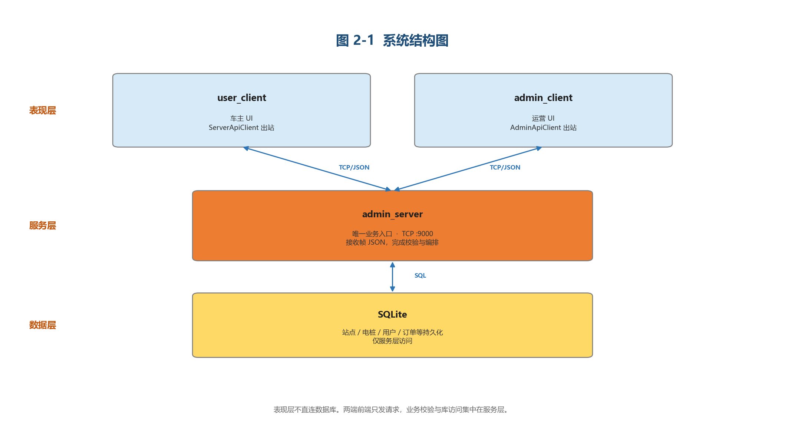

**图 2-1 系统结构图**

| 子系统 | 技术 | 核心职责 |
|---|---|---|
| `user_client` | Qt6 Widgets + Network | 车主 UI；经 `ServerApiClient` 调 TCP API |
| `admin_client` | Qt6 Widgets + Charts + Network | 运营 UI；经 `AdminApiClient` 调 TCP API |
| `admin_server` | Qt6 Network + SQL | 唯一服务入口；独占 SQLite |

**设计取舍**：两端共用端口 9000 和同一套帧协议，避免再维护一套 HTTP 客户端。定位、主题、关键字过滤等与服务器状态无关的事留在本端，减少往返。

---

## 3 模块详细概述

### 3.1 用户客户端模块（user_client）

用户端按「先登录、再办事、最后付钱」切开三个业务子模块。`LoginDialog` 只解决身份，`MainWindow` 用底栏承载任务流，避免一个窗口同时处理登录和充电。定位单独做成 `LocationProvider`，因为找站需要坐标，充值和登录不需要。

#### 3.1.1 模块功能定义

表 3-1 模块功能描述

| 序号 | 二级模块 | 功能点 | 功能点详细内容 |
|---|---|---|---|
| 1 | 账号管理与登录 | 用户登录/登出 | 输入 11 位手机号与密码登录；成功后展示昵称并缓存 token。登出清除本端会话并回登录页。登录失败不自动建号。重点：先拦空输入，再出站；失败清密码框。 |
| 2 | 账号管理与登录 | 用户注册 | 填写手机号、密码、昵称；手机号已存在则拒绝。注册成功即进入登录态。重点：与登录共用窗体，避免两套会话写入。 |
| 3 | 账号管理与登录 | 登录注册界面 | `LoginDialog` 用堆叠页切换；占位提示；按钮有反馈；失败对话框提示。 |
| 4 | 用户服务 | 定位服务 | `LocationProvider` 取近似经纬度，失败回落到北京默认点，保证找站列表仍可排序。 |
| 5 | 用户服务 | 附近电站查询 | 列表展示站名、地址、距离、空闲桩、营业状态；关键字与城区筛选；默认按距离优先。收藏站可置顶展示。 |
| 6 | 用户服务 | 电站导航 | 选中站点后把名称与坐标交给外部地图/网页，本端不嵌地图引擎。 |
| 7 | 用户服务 | 电桩查询与筛选 | 展示站内桩状态（空闲/充电中/已预约/故障/离线等），可按功率类型、连接器筛选，支持收藏标记。 |
| 8 | 用户服务 | 电桩预约 | 对空闲桩预约约 15 分钟，界面倒计时。同一用户最多 3 条有效预约；被预约的桩他人不可再约。 |
| 9 | 用户服务 | 电桩/站点收藏 | 收藏常用站或桩，列表可“仅看收藏”。收藏变化后立刻刷新当前列表。 |
| 10 | 用户服务 | 预约暂存与恢复 | 再次进入客户端时拉取仍有效的预约，继续倒计时。本端不持久化预约业务数据。 |
| 11 | 用户服务 | 充电管理 | 校验余额后开始充电并生成订单；展示进度、电量与费用；可结束并结算。同时只允许一笔进行中订单。 |
| 12 | 用户服务 | 个人中心 | 查看/修改昵称、车型、车牌，展示余额与账号状态。 |
| 13 | 用户服务 | 断线重连 | 重连后恢复进行中的预约与充电订单，避免界面停在过期状态。 |
| 14 | 支付业务 | 钱包充值 | 展示余额；自定义金额与快捷面额；成功后刷新余额。 |
| 15 | 支付业务 | 充电记录 | 表格展示订单号、站点/电桩、电量、金额、中文状态。 |
| 16 | 界面组织 | 底部导航 | 底栏在「充电站 / 充电 / 我的」切换；充电页内再分预约、我的预约、充电子页。当前项高亮。 |

#### 3.1.2 模块结构

本模块划分为 **账号管理与登录、用户服务、支付业务** 三个业务子模块，由 `LocationProvider`、`ServerApiClient` 支撑。三个业务子模块互不调用，避免充值改到找站、登录改到充电。

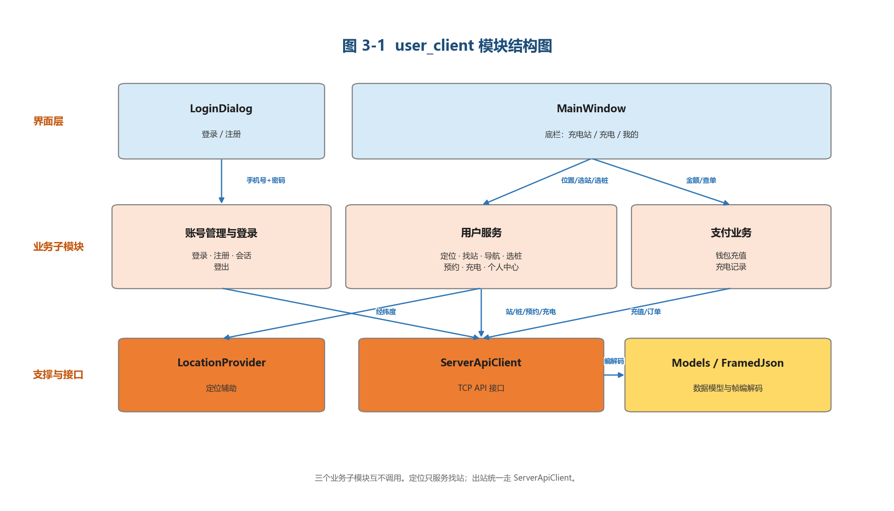

**图 3-1 user_client 模块结构图**

| 模块名称 | 模块类型 | 概要说明 |
|---|---|---|
| LoginDialog | 界面 | 登录/注册窗体，采集手机号、密码、昵称 |
| MainWindow | 界面 | 底栏导航容器：充电站、充电、我的 |
| 账号管理与登录 | 业务子模块 | 登录、注册、登出与会话缓存 |
| 用户服务 | 业务子模块 | 定位、找站、导航、预约、充电、个人中心、重连 |
| 支付业务 | 业务子模块 | 钱包充值与充电记录 |
| LocationProvider | 内部模块 | 提供近似经纬度 |
| ServerApiClient | 接口 | TCP 连接、帧编解码、action 调用、token 管理 |

**（1）账号管理与登录子模块**

登录与注册共用一个对话框，是为了会话写入只有一处：成功都得到 `User + token`，主窗构造方式相同。登出入口放在主窗，避免登录窗还活着时出现第二套会话。

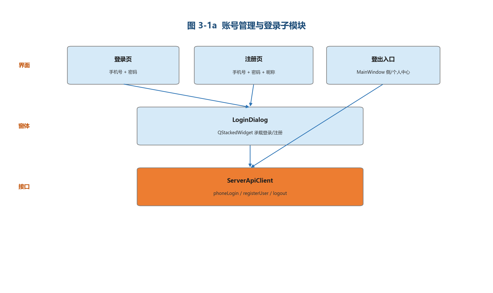

**图 3-1-1a 账号管理与登录子模块结构图**

| 模块名称 | 模块类型 | 概要说明 |
|---|---|---|
| 登录界面 | 界面 | 手机号 + 密码登录 |
| 注册界面 | 界面 | 手机号 + 密码 + 昵称注册 |
| 登出入口 | 界面 | 清除 token 并返回登录 |
| LoginDialog | 界面组件 | 统一承载登录/注册交互 |
| ServerApiClient | 接口 | `phoneLogin` / `registerUser` / `logout` |

**（2）用户服务子模块**

找站依赖定位，选桩依赖已选站点，预约/充电依赖已选桩，因此本子模块内部是「位置 → 站 → 桩 → 订单」的依赖网，而不是五个并列按钮各调一次接口。断线重连只恢复预约和进行中订单，不重放充值。

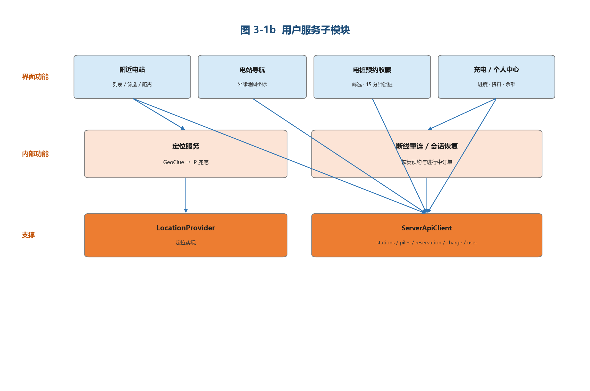

**图 3-1-1b 用户服务子模块结构图**

| 模块名称 | 模块类型 | 概要说明 |
|---|---|---|
| 定位服务 | 内部功能 | 经纬度获取，供距离排序 |
| 附近电站查询 | 界面功能 | 列表、筛选、距离展示 |
| 电站导航 | 界面功能 | 调起外部地图导航 |
| 电桩查询/预约/收藏 | 界面功能 | 选桩、预约 15 分钟、收藏 |
| 充电管理 | 界面功能 | 开始/进度/结束充电 |
| 个人中心 | 界面功能 | 资料维护与余额展示 |
| 断线重连 | 内部功能 | 恢复预约与进行中订单 |
| LocationProvider | 内部模块 | 定位实现 |
| ServerApiClient | 接口 | stations / piles / reservation / charge / user |

**（3）支付业务子模块**

充值与记录都挂在「我的」，与找站列表隔离，避免钱包刷新牵动电站排序。

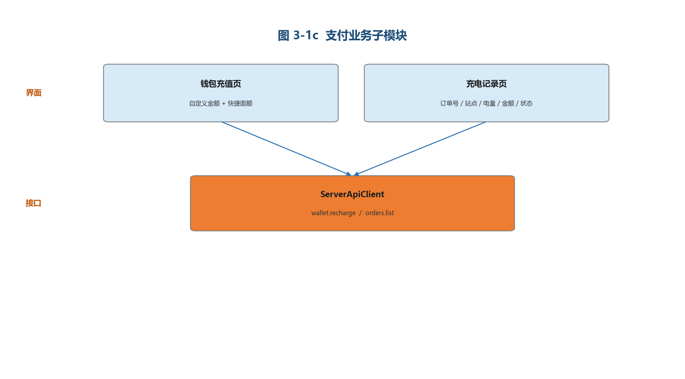

**图 3-1-1c 支付业务子模块结构图**

| 模块名称 | 模块类型 | 概要说明 |
|---|---|---|
| 钱包充值页 | 界面 | 金额输入与发起充值 |
| 充电记录页 | 界面 | 历史订单表格 |
| ServerApiClient | 接口 | `rechargeUser` / `listOrders` |

#### 3.1.3 模块动作时序图

时序图里的「服务端」是黑盒：客户端只关心发出的方法与返回的数据。

**（1）账号管理与登录**

流程：提交登录 → 得到 token 与用户 → 进入主窗。注册为可选并行入口。

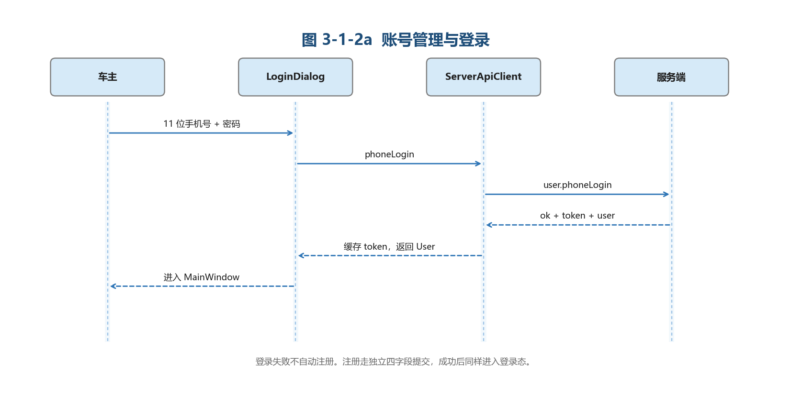

**图 3-1-2a 账号管理与登录时序图**

**（2）用户服务 · 找站与选桩**

流程：定位（可失败）→ 查附近电站 → 选站后查站内电桩并筛选。

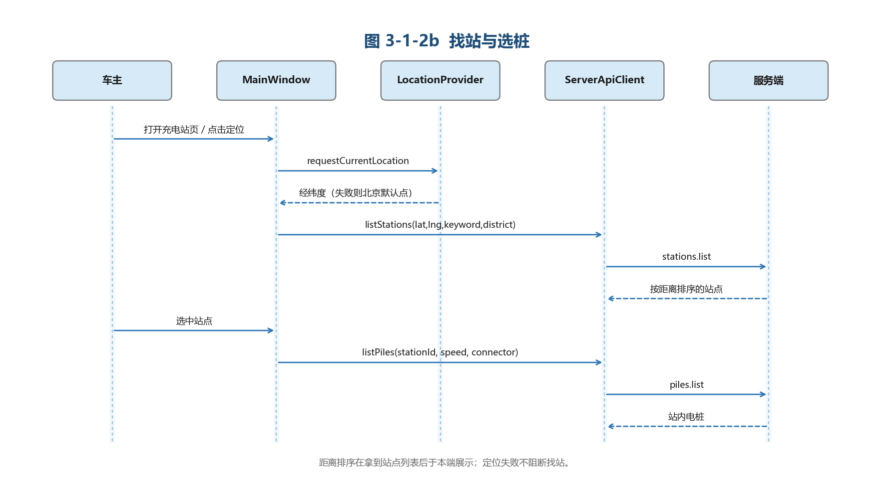

**图 3-1-2b 找站与选桩时序图**

**（3）用户服务 · 预约与充电**

流程：预约锁桩 → 开始充电建单 → 进度上报 → 结束结算。

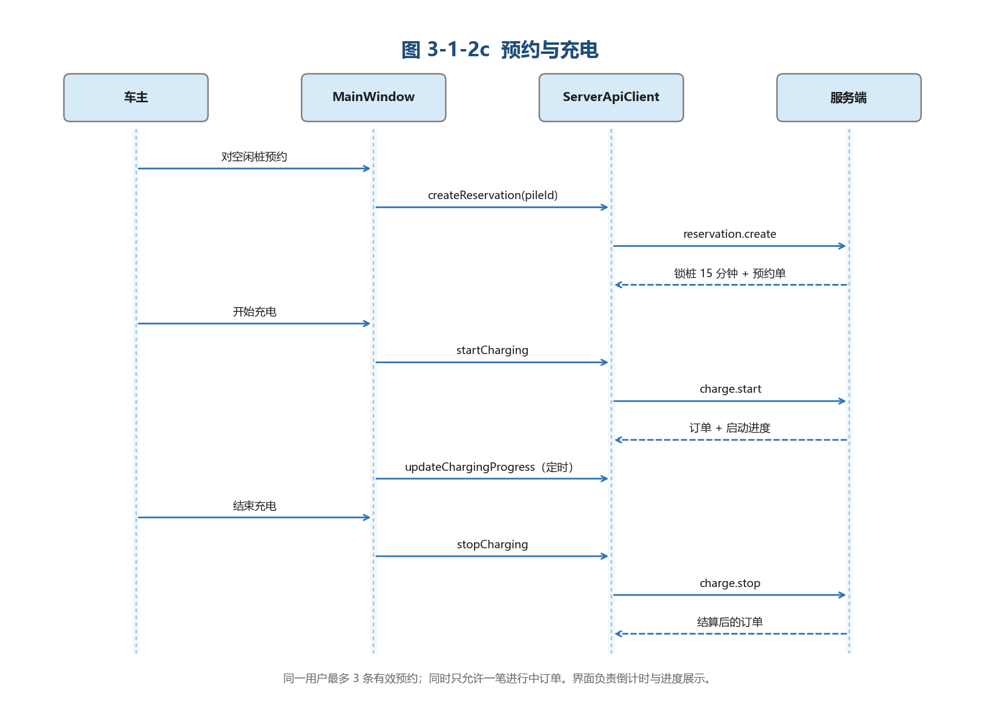

**图 3-1-2c 预约与充电时序图**

**（4）支付业务**

流程：充值刷新余额 → 查询充电记录并展示。

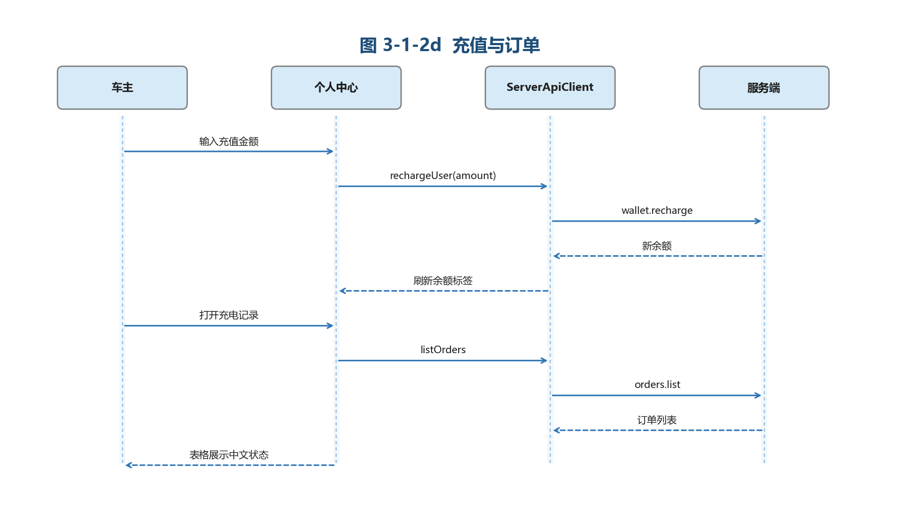

**图 3-1-2d 充值与订单时序图**

---

### 3.2 管理员客户端模块（admin_client）

管理端面对的是「先证明你是管理员，再同时看钱、看设备和看人」。因此业务切成账号、运营监控、财务管理三块，另加主题切换。侧栏是页面容器，不是业务模块——重启、发码分别挂在充电桩管理页和权限页上，避免侧栏条目膨胀。

四个业务子模块互不调用。账号、运营、财务都只认识 `AdminApiClient`；主题只认识 `StyleHelper` 和 `QSettings`。这样换肤不会误触发删桩，看报表也不必先加载全部电桩。

#### 3.2.1 模块功能定义

表 3-2 模块功能描述

| 序号 | 二级模块 | 功能点 | 功能点详细内容 |
|---|---|---|---|
| 1 | 账号管理与登录 | 用户登录/登出 | 管理员输入**账号和密码**（不是手机号）登录，进入侧栏工作台，按角色看到可管理范围。退出调用 `logout`，清 token，回到登录窗。重点：登录失败不建号；会话只缓存在 `AdminApiClient`。 |
| 2 | 账号管理与登录 | 用户注册 | 填写账号、密码、姓名和邀请码。账号已存在则提示并拒绝。邀请码必须未被使用。注册成功即登录。重点：开放注册不可行，用邀请码把门。 |
| 3 | 账号管理与登录 | 登录注册界面 | 与用户端一样用堆叠页统一窗体；占位提示；失败对话框；登录失败清空密码。 |
| 4 | 账号管理与登录 | 邀请码 | 具备发码权限的管理员在**权限管理页**选择 `operator` / `auditor` 生成一次性码，弹窗展示明文。他人用该码完成功能点 2。创建与消耗分处两页，是有意的：发码是运营动作，消耗是未登录动作。 |
| 5 | 运营监控 | 电桩管理 | 拆成两页是因为「看全局健康」和「改一台桩」的数据粒度不同。① 电桩状态：饼图 + 数量占比 + 关键字明细（关键字在**本端**过滤已取回的全量列表）。② 充电桩管理：城区→电站→状态级联筛选，表格含编号、状态、功率、类型、所属站、剩余电量等，支持增删改。占用中删除先返回 `NEED_FORCE`，二次确认后再删。 |
| 6 | 运营监控 | 电站管理 | 列表展示站编号、名称、地址、经纬度、总桩数、在线率（**百分比文本，本端不按颜色区分**）。按站名或地址搜索。点击行加载该站电桩明细。支持增删改；站内有占用桩时同样两阶段删除。 |
| 7 | 运营监控 | 预约管理 | 只列当前有效预约。解除后该预约失效、对应桩回空闲。本端刷新列表即可看到结果。 |
| 8 | 运营监控 | 后台重启 | 不是独立页。按钮只在充电桩管理**选中故障桩**时出现，防止对正常桩误发重启。调用后先显示维修中，随后恢复空闲。 |
| 9 | 运营监控 | 用户管理 | 按手机号模糊查：编号、手机、昵称、余额、注册时间、状态。冻结/解冻。**正在充电则拒绝冻结**（不自动停单，避免运营误切正在充电的车）。冻结时取消该用户**最近一条**有效预约（用户最多可有 3 条，其余不动）。冻结后该账号无法再预约或充电。 |
| 10 | 财务管理 | 销售业绩报表 | 进入即见今日/本月/总营收；7 日或 30 日折线可切换；下方最近订单。一次 `dashboard` 拉齐三块数据，避免 KPI、图、表各打一枪。图在本端绘制。 |
| 11 | 界面美化 | 白天/夜间模式调节 | 侧栏开关切换两套 QSS；图表与表格随主题重绘。选择写入本机 `QSettings`，下次启动恢复。不为此访问网络。 |

#### 3.2.2 模块结构

本模块分为 **账号管理与登录、运营监控、财务管理** 三个主要子模块，统一由 `AdminApiClient` 出站；白天/夜间模式由 `StyleHelper` 支持。

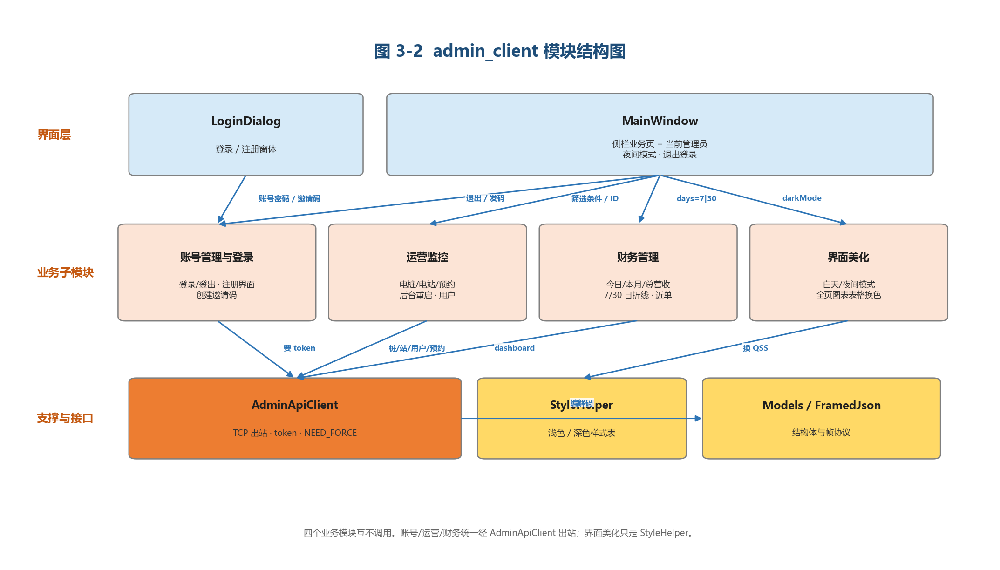

**图 3-2 admin_client 模块结构图**

| 模块名称 | 模块类型 | 概要说明 |
|---|---|---|
| LoginDialog | 界面 | 登录/注册窗体，采集账号、密码、姓名、邀请码 |
| MainWindow | 界面 | 侧栏功能容器：销售业绩与各项运维页 |
| 账号管理与登录 | 业务子模块 | 登录、注册、登出、会话缓存、邀请码 |
| 财务管理 | 业务子模块 | 销售 KPI、折线、最近订单 |
| 运营监控 | 业务子模块 | 电桩/电站/用户/预约；重启与发码挂在对应页 |
| StyleHelper | 内部模块 | 浅色/深色样式表 |
| AdminApiClient | 接口 | TCP 连接、帧编解码、action 调用、token、`NEED_FORCE` |

**（1）账号管理与登录子模块**

本子模块的设计中心不是接口，而是两块会话数据。`m_token + Admin` 决定主窗能不能开、侧栏显示谁；邀请码把「已登录的发码页」和「未登录的注册页」连起来。四个界面入口都进 `AdminApiClient`，但写入的目标不同：登录/注册写 token，退出清 token，发码写明文码。

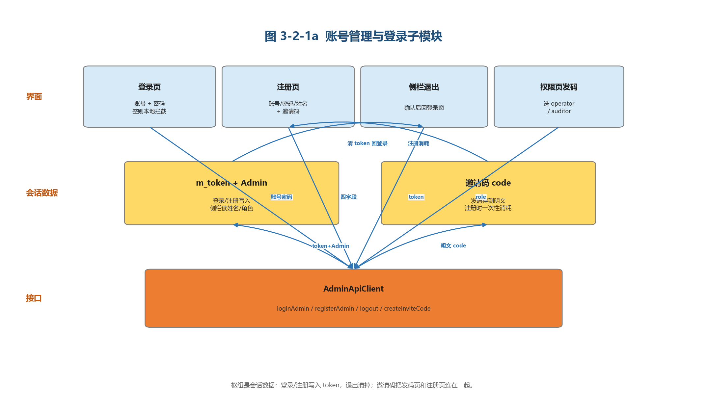

**图 3-2-1a 账号管理与登录子模块结构图**

| 模块名称 | 模块类型 | 概要说明 |
|---|---|---|
| 登录页 | 界面 | 账号 + 密码；空输入不出站 |
| 注册页 | 界面 | 账号、密码、姓名、邀请码 |
| 侧栏退出 | 界面 | 清 token，循环回登录窗 |
| 权限页发码 | 界面 | 选择角色后生成一次性码 |
| m_token + Admin | 会话数据 | 登录态枢纽 |
| 邀请码 code | 会话数据 | 发码与注册之间的一次性凭证 |
| AdminApiClient | 接口 | `loginAdmin` / `registerAdmin` / `logout` / `createInviteCode` |

**（2）运营监控子模块**

图 3-2-1b 按代码画调用关系：上面是五个运营页，中间是该页触发的 `MainWindow` 成员函数（同列自上而下即互调），所有出站落到最下面同一个 `AdminApiClient` 框里的不同方法。线上不写字，避免挡框。

对照实现时注意这几条互调：

- `onPileDistrictChanged` 先 `rebuildPileStationFilter`，再 `refreshPiles`；`refreshPiles` 自己也会再调一次 `rebuildPileStationFilter`（`districts` + `listStations` + `listPiles`）。
- `refreshPileStatus` 调 `pileStats` 与 `listPiles(-1)`，关键字只在函数内过滤，不进参数。
- 增删改桩/站成功后回调 `refreshPiles` / `refreshPileStatus` / `refreshStations`。删除先 `delete*(false)`，`needsForce()` 为真再 `confirmForce` 后 `delete*(true)`。
- `onRestartPile` 只接受 `fault`，成功后 `refreshPiles`，1.8 秒后再刷桩表和状态页。
- `onStationRowClicked` 只调 `listStationPiles`。
- `onCancelReservation` 成功后再刷预约、桩表、状态页。

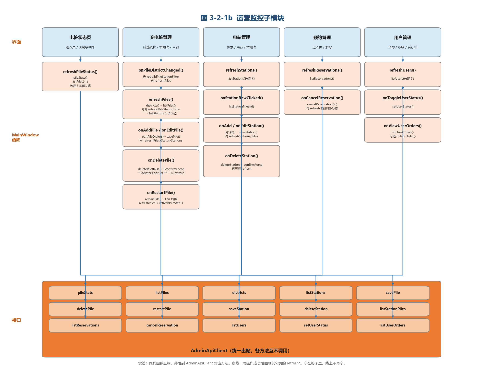

**图 3-2-1b 运营监控子模块结构图**

| 模块名称 | 模块类型 | 概要说明 |
|---|---|---|
| 电桩状态页 | 界面 | 饼图、占比、本端关键字明细 |
| 充电桩管理 | 界面 | 级联筛选、增删改、故障重启 |
| 电站管理 | 界面 | 检索、点行查明细、增删改 |
| 预约管理 | 界面 | 有效预约列表与解除 |
| 用户管理 | 界面 | 手机号查询、冻结/解冻 |
| 关键字过滤 | 本地逻辑 | 不把关键字送出站 |
| 级联筛选 | 本地逻辑 | 城区 → 站点 → 状态 |
| 二次确认 | 本地逻辑 | `force=false` 探测，`NEED_FORCE` 后再删 |
| 重启按钮 | 本地逻辑 | 仅故障桩可见 |
| stats / Pile[] / Station[] / Reservation[] / User[] | 数据对象 | 多页共享的本端缓存 |
| AdminApiClient | 接口 | piles / stations / reservations / users / pileStats |

**（3）财务管理子模块**

报表页最容易被做成三次请求。本设计规定：**进入、刷新、切天数都只打一次 `dashboard`**，得到 `{stats, dailySales, recentOrders}`，再扇出到三个控件。折线不向服务端要图片，以免主题切换还要再生成图。本页不查询电桩，营收和设备健康分开，避免销售页被桩列表拖慢。

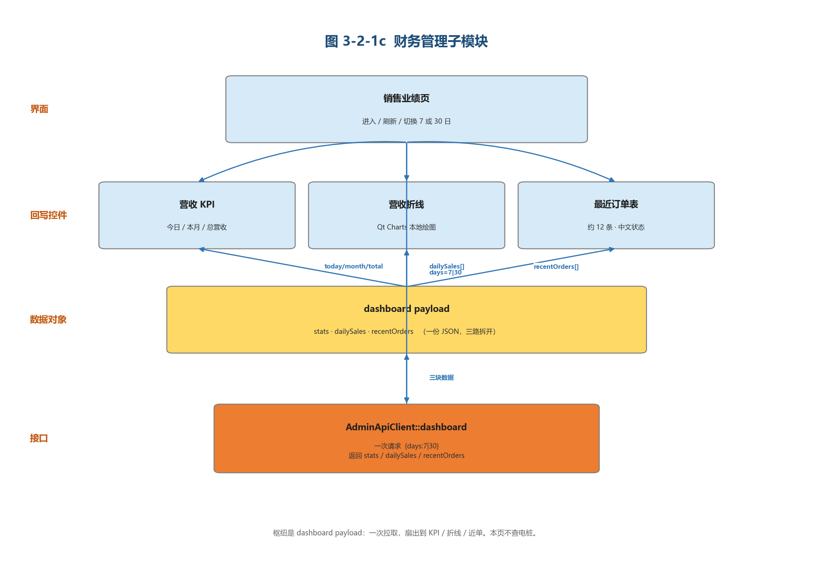

**图 3-2-1c 财务管理子模块结构图**

| 模块名称 | 模块类型 | 概要说明 |
|---|---|---|
| 销售业绩页 | 界面 | 进入 / 刷新 / 切换 7 或 30 日 |
| 营收 KPI | 回写控件 | 今日 / 本月 / 总营收 |
| 营收折线 | 回写控件 | Qt Charts 本地绘图 |
| 最近订单表 | 回写控件 | 约 12 条，状态译中文 |
| dashboard payload | 数据对象 | 一份 JSON，三路拆开 |
| AdminApiClient | 接口 | `dashboard(days)` |

**（4）界面美化子模块**

主题与业务解耦：开关同时写样式和本机配置。图表颜色不跟 QSS 走，所以换肤后再走一遍已有的业绩/桩状态刷新，只为换画笔，不增加新业务接口。

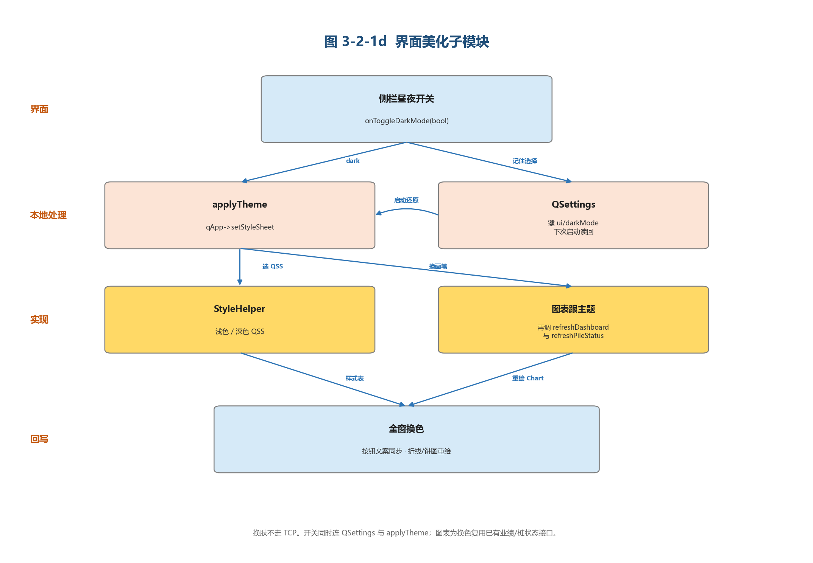

**图 3-2-1d 界面美化子模块结构图**

| 模块名称 | 模块类型 | 概要说明 |
|---|---|---|
| 侧栏昼夜开关 | 界面 | `onToggleDarkMode(bool)` |
| applyTheme | 本地处理 | `qApp->setStyleSheet` |
| QSettings | 本地处理 | 键 `ui/darkMode`，启动还原 |
| StyleHelper | 内部模块 | 浅色 / 深色 QSS |
| 图表跟主题 | 本地处理 | 复用 `refreshDashboard` / `refreshPileStatus` |
| 全窗换色 | 回写 | 按钮文案、表格、折线/饼图 |

#### 3.2.3 模块动作时序图

**（1）账号管理与登录**

流程：提交登录或带邀请码注册 → 缓存 token → 打开主窗。

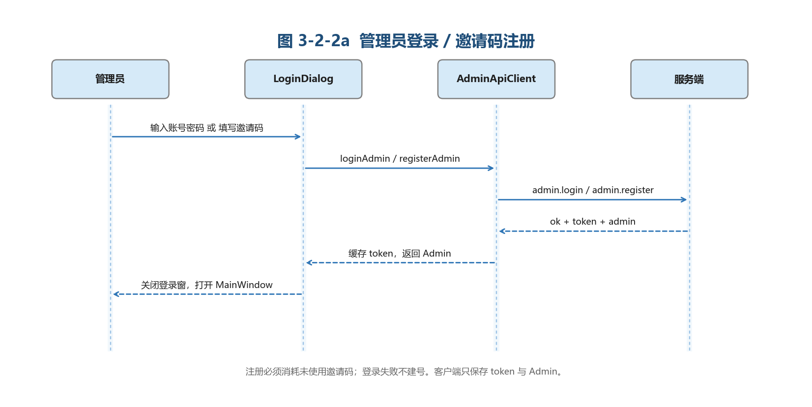

**图 3-2-2a 管理员登录 / 邀请码注册时序图**

**（2）财务管理**

流程：进入或切天数 → 一次 dashboard → 本端拆到 KPI / 折线 / 近单。

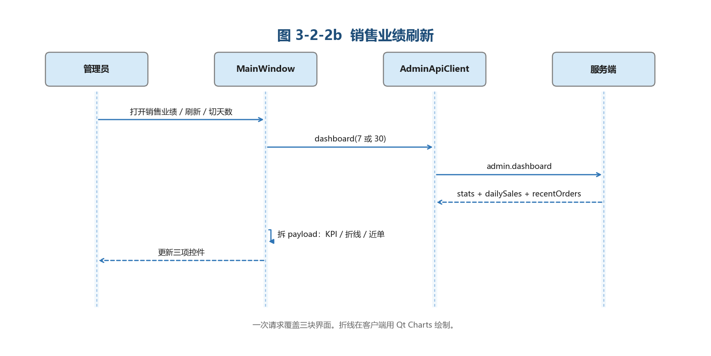

**图 3-2-2b 销售业绩刷新时序图**

**（3）运营监控 · 删除**

流程：先 `force=false` 探测 → 若占用则二次确认 → 再 `force=true` → 刷新三页。

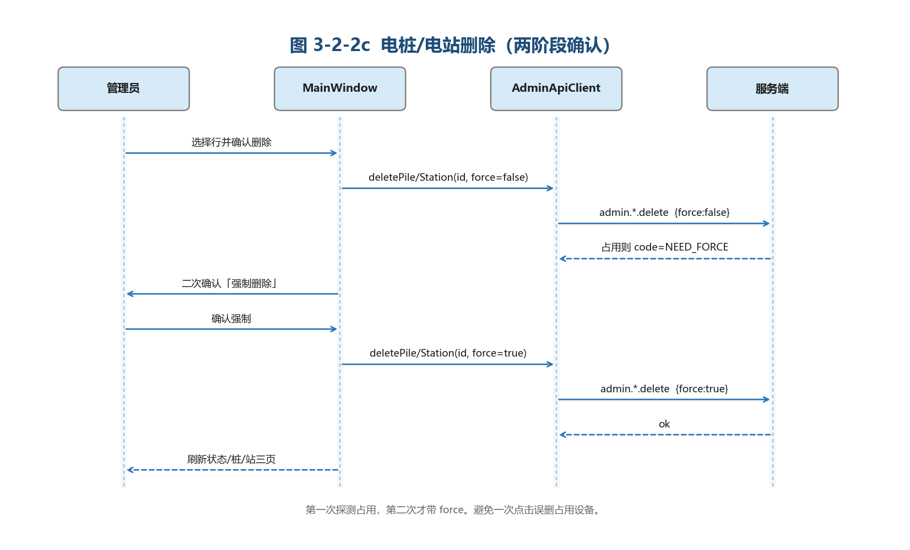

**图 3-2-2c 电桩/电站删除时序图**

**（4）邀请码发放**

流程：权限页选角色 → 生成 → 对话框展示明文。

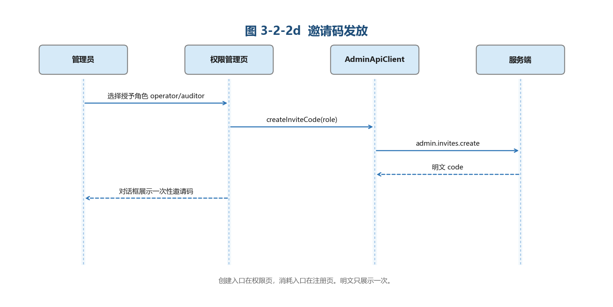

**图 3-2-2d 邀请码发放时序图**

---

## 4 接口说明

本章给出设计时必须遵守的契约。改界面可以换控件，但不能悄悄改字段含义或漏掉 `NEED_FORCE` 处理。

### 4.1 数据结构定义

下列结构体定义于 `common/Models.h`，两端共用。密码字段仅在注册/登录请求中使用，列表回写不得展示。

**User（车主）**

| 字段 | 类型 | 说明 |
|---|---|---|
| id | int | 用户编号 |
| username / phone | QString | 登录标识，用户端以 11 位手机号为主 |
| nickname | QString | 展示名 |
| balance | double | 钱包余额 |
| carModel / plateNumber | QString | 个人资料 |
| status | QString | `normal` / `frozen` |
| createdAt | QString | 注册时间 |

**Admin（管理员）**

| 字段 | 类型 | 说明 |
|---|---|---|
| id | int | 管理员编号 |
| username | QString | 登录账号 |
| realName | QString | 侧栏显示 |
| role | QString | `admin` / `operator` / `auditor` |

**Station**

| 字段 | 类型 | 说明 |
|---|---|---|
| id / stationCode / name / address | — | 标识与位置文案 |
| latitude / longitude | double | 导航与距离 |
| totalPiles / idlePiles | int | 规模与空闲 |
| onlineRate | double | 在线率，管理端按百分比文本显示 |
| status | QString | `open` / `closed` / `maintenance` |
| distanceKm | double | 用户端按当前坐标计算后展示 |

**Pile**

| 字段 | 类型 | 说明 |
|---|---|---|
| id / pileCode | — | 电桩标识 |
| stationId / stationName / stationAddress | — | 所属站 |
| pileType / speedClass / connectorStandard / powerKw | — | 筛选与展示 |
| status | QString | `idle` / `reserved` / `charging` / `fault` / `offline` / `restarting` |
| remainingKwh | double | 剩余电量 |
| favorite | bool | 用户端收藏标记 |
| totalChargeCount | int | 累计充电次数（结构体具备，管理表按页展示需要的列） |

**ChargingReservation**

| 字段 | 类型 | 说明 |
|---|---|---|
| id / reservationNo | — | 预约标识 |
| userId / pileId | int | 关联 |
| reservedAt / expiresAt | QString | 约 15 分钟窗口 |
| status | QString | 管理端列表只取有效预约 |
| pileCode / stationName / username / phone | QString | 展示冗余字段，避免再查 |

**ChargingOrder**

| 字段 | 类型 | 说明 |
|---|---|---|
| id / orderNo | — | 订单标识 |
| energyKwh / amount | double | 电量与金额 |
| status | QString | 进行中 / 已完成等，界面译中文 |
| stationName / username | QString | 报表与记录展示 |

**InviteCode**

| 字段 | 类型 | 说明 |
|---|---|---|
| code | QString | 明文只在创建当时给一次 |
| role | QString | 绑定 `operator` 或 `auditor` |
| usedBy / usedAt | — | 是否已消耗 |

**dashboard payload（管理端销售页）**

| 字段 | 说明 |
|---|---|
| stats.todayAmount / monthAmount / totalAmount | KPI |
| stats 中的桩数量字段 | 电桩状态页饼图复用 `dashboard(7)` 的统计 |
| dailySales[] | 折线：日期 + 金额 |
| recentOrders[] | 近单表，约 12 条 |

### 4.2 通信约定

- 传输：TCP，默认 `127.0.0.1:9000`。
- 报文：`FramedJson`，单帧不超过 4MB。
- 请求体含 `action`、`data`，已登录请求由客户端自动附带 `token`。
- 应答含成功标志、业务数据或 `code` / 错误信息。管理端删除占用设备时必须识别 `NEED_FORCE`。

### 4.3 用户端出站接口（ServerApiClient）

| 客户端函数 | action（参考） | 主要参数 | 返回 | 说明 |
|---|---|---|---|---|
| `phoneLogin` | `user.phoneLogin` | phone, password | token, user | 失败不建号 |
| `registerUser` | `user.register` | phone, password, nickname | user | 手机号唯一 |
| `logout` | `user.logout` | token | — | 清本端会话 |
| `listStations` | `stations.list` | lat, lng, keyword, district | Station[] | 距离排序供展示 |
| `listPiles` | `piles.list` | stationId, speed, connector | Pile[] | 站内筛选 |
| `createReservation` | `reservation.create` | pileId | Reservation | 15 分钟锁桩 |
| `cancelReservation` | `reservation.cancel` | reservationId | — | 用户取消 |
| `getActiveReservation` | — | — | Reservation | 恢复倒计时 |
| `startCharging` / `updateChargingProgress` / `stopCharging` | `charge.*` | userId, pileId, energy | Order | 一笔进行中订单 |
| `rechargeUser` | `wallet.recharge` | amount | 新余额 | 充值后刷新标签 |
| `listOrders` | `orders.list` | userId | Order[] | 充电记录 |
| `toggleFavorite` | — | type, id | nowFavorite | 与列表联动 |

### 4.4 管理端出站接口（AdminApiClient）

| 客户端函数 | action（参考） | 主要参数 | 返回 | 说明 |
|---|---|---|---|---|
| `loginAdmin` | `admin.login` | username, password | token, admin | 失败不建号 |
| `registerAdmin` | `admin.register` | username, password, realName, inviteCode | token, admin | 邀请码一次性；账号重复拒绝 |
| `logout` | `admin.logout` | token | — | 清本端 token |
| `createInviteCode` | `admin.invites.create` | role | code | 角色限 operator/auditor |
| `dashboard` | `admin.dashboard` | days=7 或 30 | stats, dailySales, recentOrders | 销售页一次拉取 |
| `pileStats` | 复用 dashboard 的 stats | days=7 | 各状态数量 | 状态页饼图 |
| `listPiles` | `admin.piles.list` | stationId, status, district | Pile[] | 状态页与管理页 |
| `savePile` / `deletePile` | `admin.piles.save/delete` | Pile 或 id+force | — | 删除认 `NEED_FORCE` |
| `restartPile` | `admin.piles.restart` | pileId | — | 界面仅对故障桩开放 |
| `listStations` / `saveStation` / `deleteStation` | `admin.stations.*` | keyword / 站字段 / id+force | Station[] | 删站同占用规则 |
| `listStationPiles` | `admin.stations.piles` | stationId | station, Pile[] | 点行加载 |
| `listReservations` / `cancelReservation` | `admin.reservations.*` | reservationId | Reservation[] | 仅有效预约 |
| `listUsers` / `setUserStatus` | `admin.users.*` | keyword / userId+status | User[] | 充电中冻结会被拒绝 |

设计者改这些接口时：先改 `Models.h` 与两端 Client，再改窗口绑定；不要在某个页面里私自拼 JSON 字段名。
