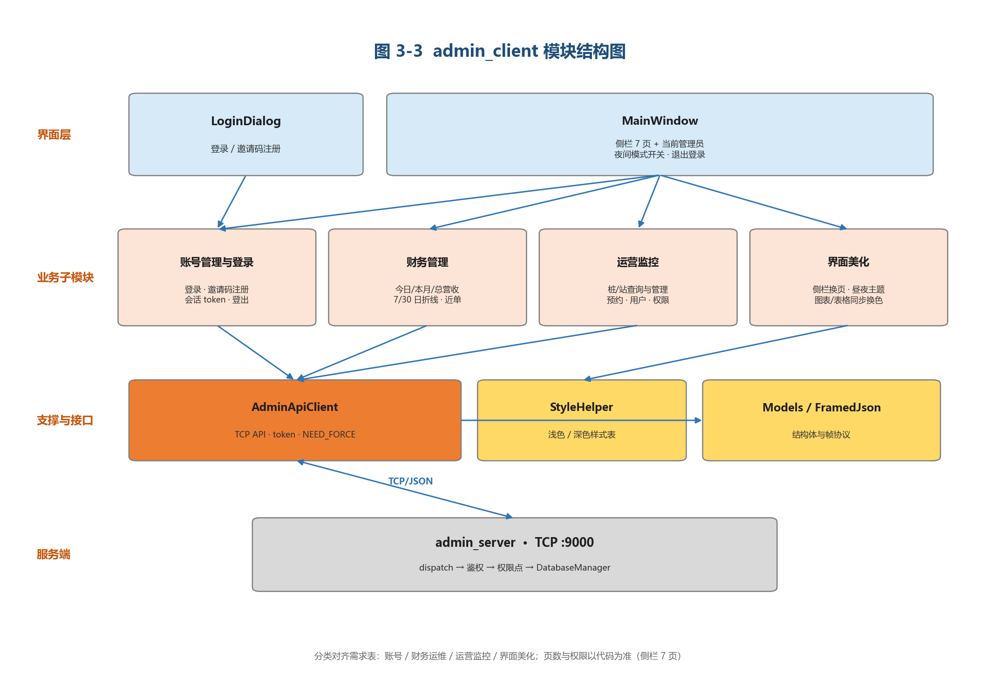
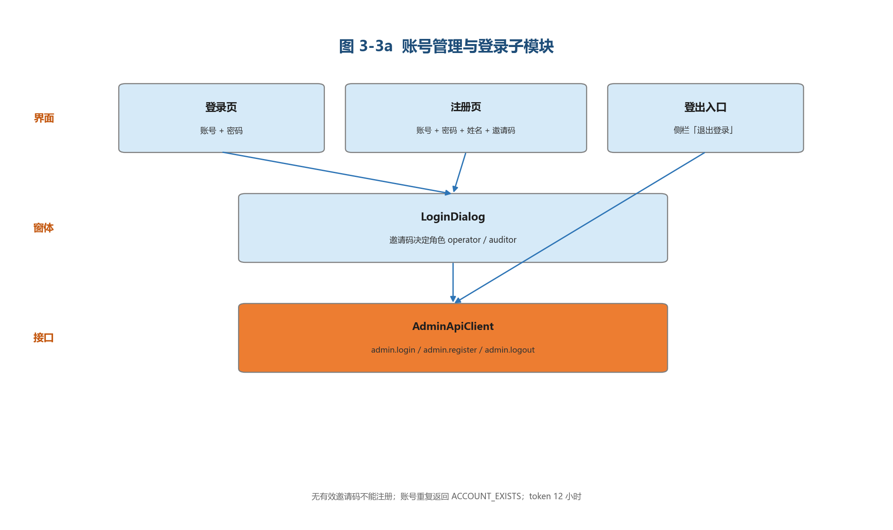
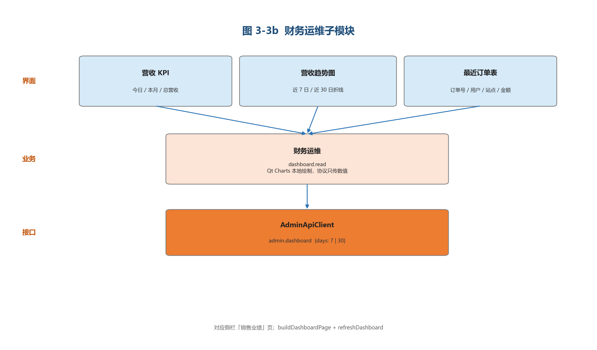
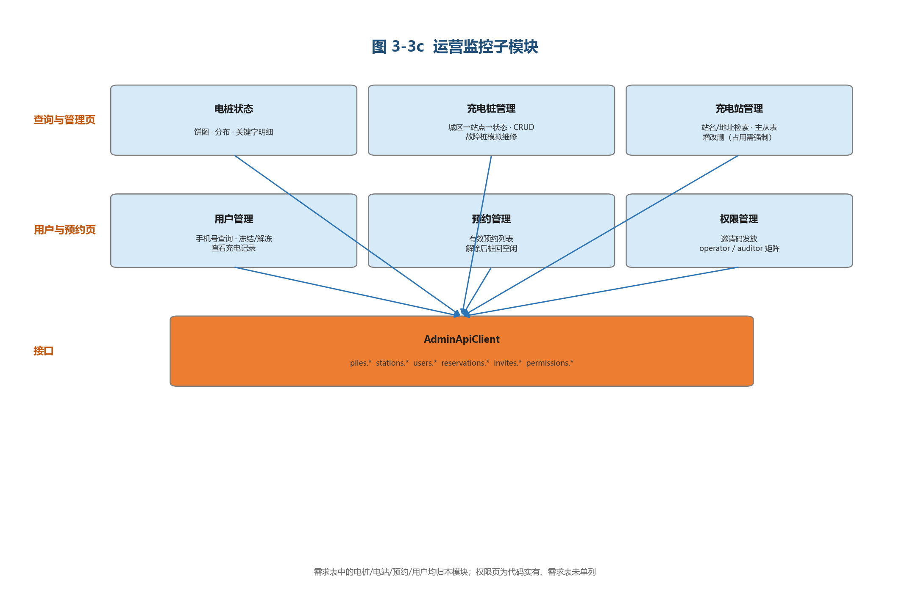
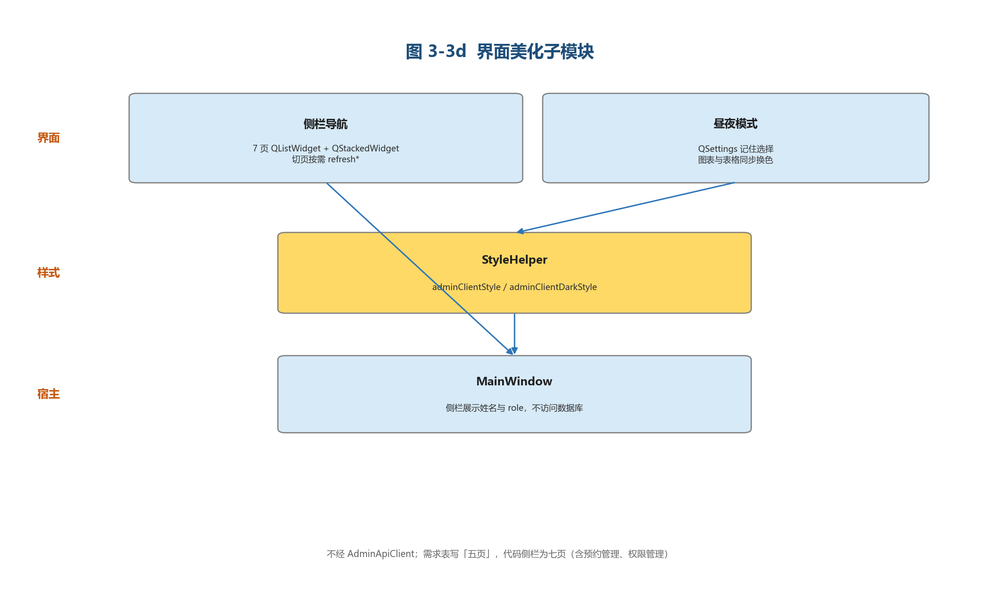
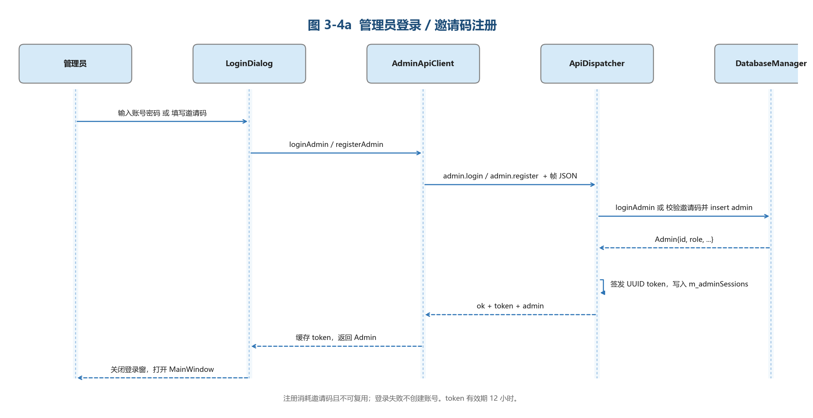
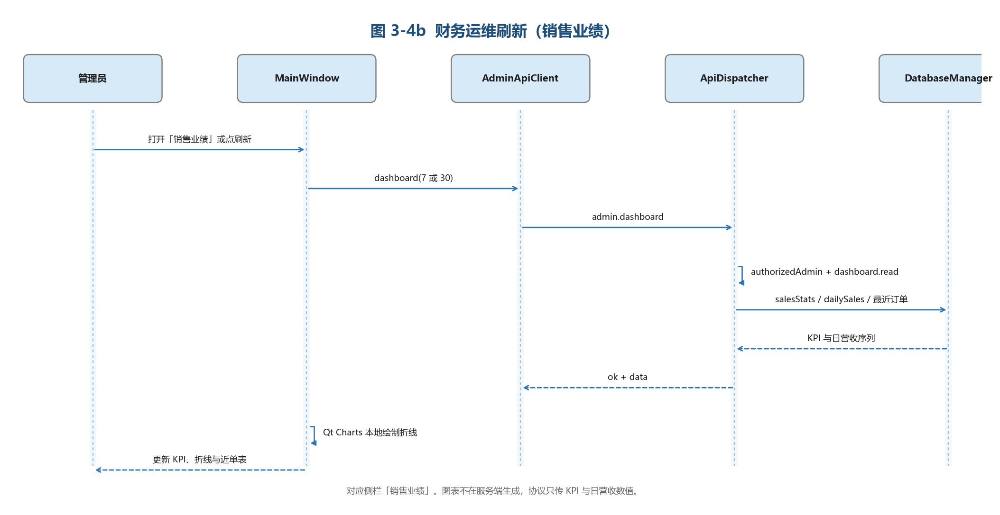
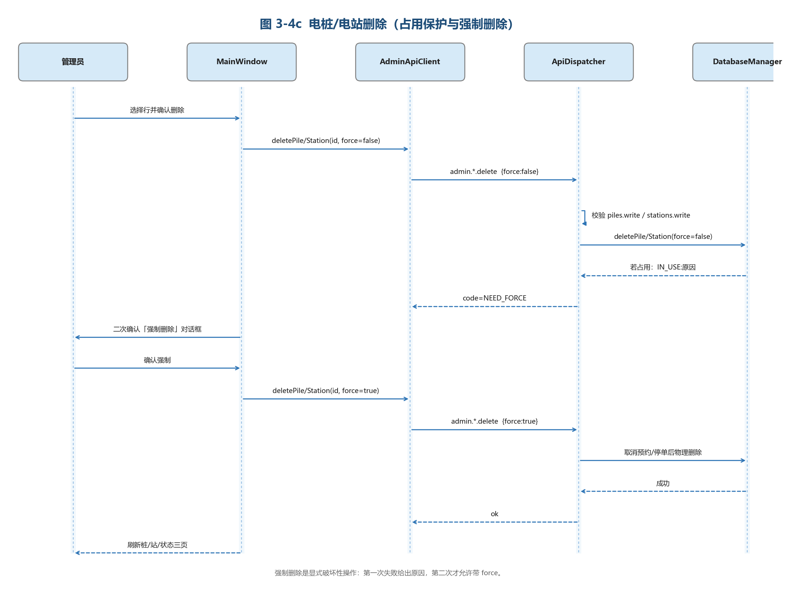
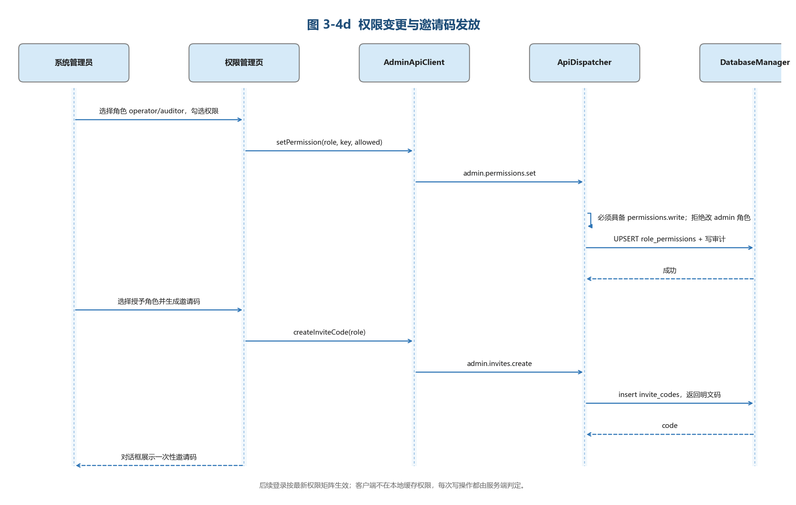

# 概要设计说明书（第 3 章 · 管理员客户端）

> 本章与用户端 3.1 节并列，编号从 **3.2** 起。分类对齐需求功能表（账号 / 财务运维 / 运营监控 / 界面美化），页数、权限与删除规则以代码为准。图由同目录 `python generate_module_diagrams.py` 生成。

## 3.2 管理员客户端模块（admin_client）

### 设计意图

需求表把管理端功能收成四类。代码用侧栏七页落地，因此结构图按需求四类切模块，页面清单按 `MainWindow::buildUi` 的真实侧栏绘制。

| 需求二级模块 | 代码落点 | 说明 |
|---|---|---|
| 账号管理与登录 | `LoginDialog` + 侧栏「退出登录」 | 邀请码开户，禁止自助成为管理员 |
| 财务运维 | 侧栏「销售业绩」 | 只要营收数字与折线，不混设备表 |
| 运营监控 | 电桩状态 / 充电桩 / 充电站 / 用户 / 预约 / 权限 | 需求表未单列权限页，代码有，归入本模块 |
| 界面美化 | 侧栏、`StyleHelper`、昼夜 `QSettings` | 不走 TCP |

需求表写「主界面五页」。代码侧栏是 **七页**（多出预约管理、权限管理）。以代码为准。

其它实现约束：

- 界面不直连 SQLite，一律经 `AdminApiClient`。
- 权限在 `ApiDispatcher` 按权限点校验，客户端不缓存矩阵。
- 删除占用中的桩/站：先 `force=false`，返回 `NEED_FORCE` 后再二次确认（需求表写「有桩在用则不能删」，代码允许强制删）。
- 远程重启只出现在选中**故障**桩时，服务端约 1.5 秒后把 `restarting` 置回 `idle`。

---

### 3.2.1 模块功能定义

表 3-2 模块功能描述

| 序号 | 二级模块 | 功能点 | 功能点详细内容 |
|---|---|---|---|
| 1 | 账号管理与登录 | 管理员登录/登出 | 输入账号与密码进入管理界面；成功后签发 12 小时 token，侧栏显示姓名与角色。登出调用 `admin.logout` 回到登录窗。重点：登录态维护。 |
| 2 | 账号管理与登录 | 管理员注册 | 填写账号、密码、姓名与邀请码。校验账号唯一性，已存在则拒绝。邀请码一次性使用，角色随码写入（`operator` / `auditor`）。重点：无邀请码不能开户。 |
| 3 | 财务运维 | 销售业绩报表 | 展示今日营收、本月营收、总营收；近 7 日 / 近 30 日折线可切换；附最近订单表。权限点 `dashboard.read`。重点：数值来自服务端，图在本地画。 |
| 4 | 运营监控 | 电桩状态查询 | 全站电桩汇总：闲置 / 在用（充电+预约）/ 故障饼图与占比表；关键字按桩号、站名、地址查明细（状态、功率、剩余电量）。只读，`piles.read`。 |
| 5 | 运营监控 | 电桩管理 | 城区 → 站点 → 状态筛选；增改删电桩。占用中删除返回 `NEED_FORCE`，二次确认后强制删除。权限点 `piles.write`。 |
| 6 | 运营监控 | 后台重启电桩 | 仅选中故障桩时显示「模拟维修（远程重启）」；置 `restarting`，约 1.5 秒后恢复空闲。重点：演示状态机，不是真实 OTA。 |
| 7 | 运营监控 | 电站状态查询 | 列表：站 ID、站名、地址、经纬度、总桩数、在线率。按站名或地址搜索。权限点 `stations.read`。 |
| 8 | 运营监控 | 电站管理 | 新增（可同时生成若干电桩）、修改、删除。站内有占用时需强制删除。点击站行查看站内桩明细。权限点 `stations.write`。 |
| 9 | 运营监控 | 预约管理 | 查看当前有效预约；手动解除后预约作废、电桩回空闲。权限点 `reservations.read` / `reservations.write`。 |
| 10 | 运营监控 | 用户管理 | 按手机号模糊查（ID、手机、昵称、余额、注册时间、状态）；冻结 / 解冻。冻结后用户端后续鉴权失败，不能再预约或充电。`users.read` / `users.write`。可查看该用户充电记录（`orders.read`）。 |
| 11 | 运营监控 | 权限管理 | 发放一次性邀请码；勾选并保存 `operator` / `auditor` 权限点。不可在界面降权 `admin`。`invites.write` / `permissions.write`。 |
| 12 | 界面美化 | 管理端 GUI | 左侧侧栏 + 右侧堆叠页。七页：销售业绩、电桩状态、充电桩管理、充电站管理、用户管理、预约管理、权限管理。侧栏顶部显示当前管理员。 |
| 13 | 界面美化 | 白天/夜间模式 | 全部页面、图表、表格同步换色；选择写入 `QSettings`，下次启动恢复。 |

---

### 3.2.2 模块结构

四个业务子模块互不调用。财务运维与运营监控都出站到 `AdminApiClient`；界面美化只落到 `StyleHelper`。

**图 3-3 admin_client 模块结构图**

| 模块名称 | 模块类型 | 概要说明 |
|---|---|---|
| LoginDialog | 界面 | 登录 / 邀请码注册 |
| MainWindow | 界面 | 侧栏七页容器、夜间模式、登出 |
| 账号管理与登录 | 业务子模块 | 登录、注册、token、登出 |
| 财务运维 | 业务子模块 | 销售 KPI、折线、最近订单 |
| 运营监控 | 业务子模块 | 桩/站/用户/预约/权限 |
| 界面美化 | 业务子模块 | 导航与昼夜主题 |
| AdminApiClient | 接口 | TCP、token、`NEED_FORCE` |
| StyleHelper | 内部模块 | 管理端浅色/深色样式 |
| Models / FramedJson | 内部模块 | 结构体与帧协议 |

#### （1）账号管理与登录

`main.cpp`：ping 通服务后循环 `LoginDialog → MainWindow`。登出不重启进程。

**图 3-3a 账号管理与登录子模块结构图**

#### （2）财务运维

只对应「销售业绩」页，不再把电桩状态算进本模块。

**图 3-3b 财务运维子模块结构图**

#### （3）运营监控

需求表中的电桩查询/管理、电站查询/管理、预约、重启、用户均在此。代码多出的权限页一并归入。

**图 3-3c 运营监控子模块结构图**

#### （4）界面美化

不访问服务端。需求写五页，代码七页。

**图 3-3d 界面美化子模块结构图**

---

### 3.2.3 模块动作时序图

#### （1）账号管理与登录

**图 3-4a 管理员登录 / 邀请码注册时序图**

#### （2）财务运维

切到销售业绩或点刷新 → `admin.dashboard` → 鉴权 `dashboard.read` → 本地画折线。

**图 3-4b 财务运维刷新时序图**

#### （3）运营监控 · 删除

确认删除 → `force=false` → 占用则 `NEED_FORCE` → 二次确认 → `force=true`。

**图 3-4c 电桩/电站删除时序图**

#### （4）运营监控 · 权限

保存 `operator` / `auditor` 勾选；生成一次性邀请码。

**图 3-4d 权限变更与邀请码发放时序图**
